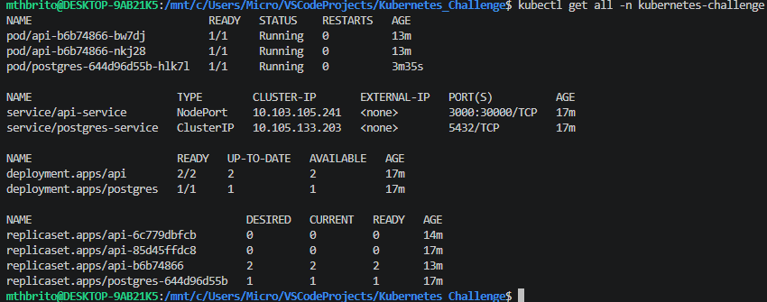
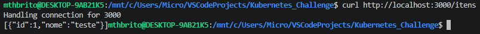
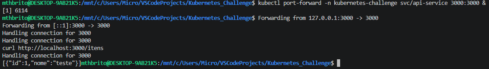
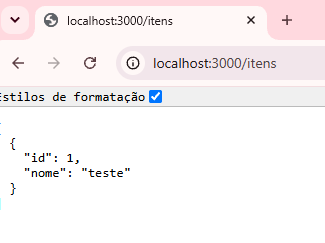
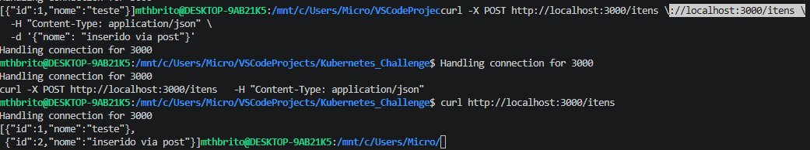
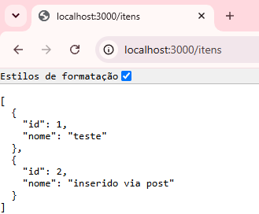
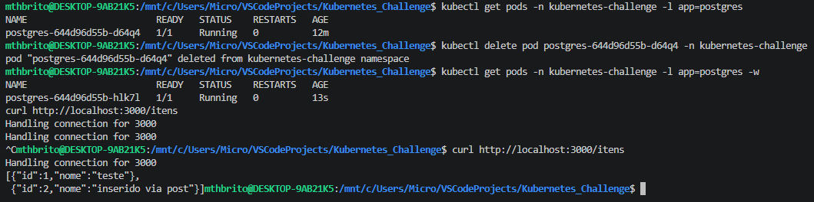

# Desafio Kubernetes

API (PostgREST) integrada a um banco PostgreSQL, rodando em Kubernetes local, com
persistência de dados, configuração externalizada, health checks e autoescala.

## Arquitetura

O fluxo é uma cadeia única, de cima para baixo: sua requisição entra pela API e a API
repassa para o banco. A API é o meio de campo — só ela conversa com as duas pontas
(você, de um lado; o Postgres, do outro):

```
 Você (curl)
     │
     │ HTTP :30000 (NodePort) ou :3000 (port-forward)
     ▼
┌──────────────────┐
│  api-service     │   Service que expõe a API para fora do cluster
└────────┬─────────┘
         │
         ▼
┌──────────────────┐
│  Deployment api  │   PostgREST — lê PGRST_DB_URI e conecta no banco
│  (PostgREST)     │   usando o NOME do Service abaixo, não um IP
└────────┬─────────┘
         │
         │ DNS interno do cluster → "postgres-service"
         ▼
┌─────────────────────┐
│  postgres-service   │   Service (ClusterIP) — só acessível dentro do cluster
└─────────┬───────────┘
          │
          ▼
┌───────────────────────┐
│  Deployment postgres  │
└──────────┬────────────┘
           │
           ▼
┌───────────────────────────┐
│  PVC (dados persistentes) │   Sobrevive mesmo se o Pod do Postgres for recriado
└───────────────────────────┘
```

A API encontra o banco pelo **nome do Service** (`postgres-service`), nunca por IP —
é assim que a conexão sobrevive a um restart do Pod do Postgres: o IP do Pod muda a
cada recriação, mas o nome do Service e o endereço do PVC não mudam.

## Pré-requisitos

- Um cluster Kubernetes local: **Minikube** (usado no desenvolvimento deste projeto,
  com driver Docker), Rancher Desktop, Docker Desktop ou Kind.
- `kubectl` configurado apontando para esse cluster.
- Nenhuma imagem precisa ser buildada — `postgres:16` e `postgrest/postgrest` são
  baixadas automaticamente do Docker Hub.

**Se você for usar Minikube com driver Docker**, o Docker precisa estar rodando
*antes* de iniciar o cluster — o driver Docker cria o nó do Kubernetes como um
container Docker:

```bash
# confirme que o Docker está de pé
docker info

# suba o cluster (se ainda não estiver rodando)
minikube start --driver=docker
```

Se o Docker não estiver ativo, `minikube start` falha com erro de conexão ao
daemon (`Cannot connect to the Docker daemon...`). Com Rancher Desktop ou Docker
Desktop, basta o app estar aberto e o Kubernetes habilitado nas configurações antes
do próximo passo.

Confirme que o cluster está de pé antes de continuar:

```bash
kubectl get nodes
# espera-se pelo menos um nó em estado Ready
```

## Estrutura dos arquivos

| Arquivo | Recurso | Observação |
|---|---|---|
| `00-namespace.yaml` | Namespace | Isola todos os recursos em `kubernetes-challenge` |
| `01-postgres-secret.example.yaml` | Secret (template) | **Não é aplicado.** Mostra a estrutura sem valores reais — veja "Criando o Secret" abaixo |
| `02-postgres-config.yaml` | ConfigMap | Nome do banco (`POSTGRES_DB`), dado não sensível |
| `03-postgres-pvc.yaml` | PersistentVolumeClaim | 1Gi, `ReadWriteOnce` — garante persistência dos dados do Postgres |
| `04-postgres-deployment.yaml` | Deployment | Postgres, credenciais via Secret/ConfigMap, volume montado em `/var/lib/postgresql/data` |
| `05-postgres-service.yaml` | Service (ClusterIP) | DNS interno `postgres-service`, usado pela API na connection string |
| `06-api-deployment.yaml` | Deployment | PostgREST, 2 réplicas, probes de liveness/readiness, requests/limits de CPU/memória |
| `07-api-service.yaml` | Service (NodePort) | Expõe a API na porta `30000` |
| `08-api-hpa.yaml` | HorizontalPodAutoscaler | Escala a API entre 1 e 5 réplicas por uso de CPU (>50%) |

> **Nota sobre `PGRST_DB_ANON_ROLE`:** em `06-api-deployment.yaml`, a role anônima do
> PostgREST é o próprio `POSTGRES_USER` (superusuário do Postgres). Na prática, isso
> significa que **qualquer `curl` na API, sem nenhuma autenticação, executa no banco
> com privilégios de superusuário** — lê e escreve em qualquer tabela, sem nenhum
> controle de permissão. É uma simplificação intencional, feita para manter o foco do
> desafio na integração via Service DNS. Em um cenário real, o correto seria criar uma
> role dedicada com permissões restritas (padrão do PostgREST: `authenticator` +
> `web_anon`), para que requisições anônimas só consigam fazer o que foi
> explicitamente liberado para elas.

## Passo 1 — Criar o Namespace

```bash
kubectl apply -f 00-namespace.yaml
```

## Passo 2 — Criar o Secret do Postgres (não é `kubectl apply -f`)

O arquivo `01-postgres-secret.example.yaml` é só um **template de referência** — não
tem valores reais e não é pensado para ser aplicado. O Secret de verdade é criado
diretamente no cluster, via comando, para nunca deixar a senha em texto legível salva
em um arquivo do repositório:

```bash
kubectl create secret generic postgres-secret \
  --namespace=kubernetes-challenge \
  --from-literal=POSTGRES_USER=postgres \
  --from-literal=POSTGRES_PASSWORD=SUA_SENHA_AQUI
```

**Importante:** use sempre `--from-literal` (ou `kubectl create secret` de forma
equivalente). **Nunca gere o valor manualmente com `echo texto | base64`** — sem a
flag `-n`, o `echo` adiciona uma quebra de linha ao final do valor, que é codificada
junto e corrompe silenciosamente usuário/senha (erro comum: PostgREST falha com
`unexpected spaces found in "..."` e o Postgres rejeita a autenticação mesmo com a
senha "certa").

Se precisar confirmar o valor decodificado:

```bash
kubectl get secret postgres-secret -n kubernetes-challenge \
  -o jsonpath='{.data.POSTGRES_PASSWORD}' | base64 -d
```

## Passo 3 — Aplicar o restante, na ordem

```bash
kubectl apply -f 02-postgres-config.yaml
kubectl apply -f 03-postgres-pvc.yaml
kubectl apply -f 04-postgres-deployment.yaml
kubectl apply -f 05-postgres-service.yaml
kubectl apply -f 06-api-deployment.yaml
kubectl apply -f 07-api-service.yaml
```

Espere o Postgres e a API ficarem prontos antes de testar:

```bash
kubectl get pods -n kubernetes-challenge -w
```

**Atenção à ordem:** o `04-postgres-deployment.yaml` e o `06-api-deployment.yaml`
referenciam o Secret criado no Passo 2 — se você aplicá-los antes de criar o Secret,
os Pods vão ficar em `CreateContainerConfigError`. Reaplique o Deployment depois de
criar o Secret, se isso acontecer.

## Passo 4 — Acessar a API (atenção se você usa Minikube com driver Docker)

O Service `api-service` é `NodePort` na porta `30000`, o que normalmente já seria
acessível via `http://localhost:30000`. **Isso não funciona no Minikube com driver
Docker no Linux/WSL** — o "nó" é, na prática, um container Docker, e a porta NodePort
não é automaticamente exposta ao host.

**Se você usa Minikube + driver Docker**, use `port-forward` com porta fixa em vez de
depender do NodePort:

```bash
kubectl port-forward -n kubernetes-challenge svc/api-service 3000:3000 &
```

A API fica disponível em `http://localhost:3000`.

**Se a porta 3000 já estiver em uso na sua máquina** (é comum — muitos projetos
Node/React sobem servidor de dev nela por padrão), o `port-forward` falha com
`bind: address already in use` ou simplesmente não responde. Nesse caso, use uma
porta local diferente, mantendo a porta do Service (`3000`) do lado direito do `:`:

```bash
kubectl port-forward -n kubernetes-challenge svc/api-service 3300:3000 &
```

A API passa a ficar disponível em `http://localhost:3300` (ajuste os `curl` dos
próximos passos de acordo com a porta que você escolheu). Para descobrir o que está
ocupando uma porta antes de trocar:

```bash
# Linux/Mac
lsof -i :3000

# Windows (PowerShell)
Get-Process -Id (Get-NetTCPConnection -LocalPort 3000).OwningProcess
```

**Se você usa Rancher Desktop, Docker Desktop ou Kind com port mapping configurado**,
o NodePort tende a funcionar direto:

```bash
curl http://localhost:30000/
```

Teste com (ajuste a porta conforme o método de acesso escolhido acima):

```bash
curl http://localhost:3000/    # port-forward padrão
# ou :3300 se trocou a porta local
# ou :30000 se está usando NodePort direto
```

Resposta esperada: um JSON descrevendo o schema exposto pelo PostgREST (mesmo sem
tabelas ainda, isso confirma que a API conectou no banco com sucesso).

## Passo 5 — Criar uma tabela e testar a integração de ponta a ponta

```bash
kubectl exec -it -n kubernetes-challenge deployment/postgres -- psql -U postgres -d challenge_db
```

Dentro do `psql`:

```sql
CREATE TABLE itens (id serial primary key, nome text);
INSERT INTO itens (nome) VALUES ('teste');
\q
```

Se a API não detectar a tabela nova automaticamente:

```bash
kubectl rollout restart deployment/api -n kubernetes-challenge
```

Teste:

```bash
curl http://localhost:3000/itens
# esperado: [{"id":1,"nome":"teste"}]
```

Insira um novo dado via `POST`, para confirmar escrita, não só leitura:

```bash
curl -X POST http://localhost:3000/itens \
  -H "Content-Type: application/json" \
  -d '{"nome": "inserido via post"}'
```

## Passo 6 — Provar a persistência (o coração do desafio)

```bash
# 1. Confirme o dado atual
curl http://localhost:3000/itens

# 2. Anote o nome do Pod do Postgres e delete-o
kubectl get pods -n kubernetes-challenge -l app=postgres
kubectl delete pod <nome-do-pod-postgres> -n kubernetes-challenge

# 3. Espere o novo Pod ficar Running (nome diferente do anotado)
kubectl get pods -n kubernetes-challenge -l app=postgres -w

# 4. Confirme que o dado ainda está lá
curl http://localhost:3000/itens
```

Se o mesmo dado aparecer depois do Pod ser recriado, a persistência via PVC está
comprovada — os dados sobrevivem porque estão no `PersistentVolumeClaim`, não no
sistema de arquivos efêmero do Pod.

## Passo 7 (bônus) — Testar o autoescalonamento (HPA)

O HPA depende do **metrics-server** para funcionar. Habilite-o (comando específico
do Minikube):

```bash
minikube addons enable metrics-server
```

**No Minikube, o metrics-server frequentemente não consegue coletar métricas por
falha de validação de certificado TLS dos kubelets.** Se `kubectl top pods` retornar
erro mesmo com o metrics-server `Running`, aplique:

```bash
kubectl patch deployment metrics-server -n kube-system --type='json' \
  -p='[{"op": "add", "path": "/spec/template/spec/containers/0/args/-", "value": "--kubelet-insecure-tls"}]'
```

Confirme que as métricas aparecem:

```bash
kubectl top pods -n kubernetes-challenge
```

Aplique o HPA:

```bash
kubectl apply -f 08-api-hpa.yaml
kubectl get hpa -n kubernetes-challenge
```

Se `TARGETS` mostrar `<unknown>` mesmo com `kubectl top` funcionando, o
`06-api-deployment.yaml` precisa ter `resources.requests.cpu` definido — sem isso o
HPA não tem base para calcular a porcentagem de utilização (este projeto já inclui
esse campo, mas é a causa mais comum desse sintoma).

Gere carga para observar a escala:

```bash
kubectl run load-generator --rm -it --image=busybox -n kubernetes-challenge \
  -- /bin/sh -c "while true; do wget -q -O- http://api-service:3000/itens > /dev/null; done"
```

Em outro terminal, observe em tempo real:

```bash
kubectl get hpa -n kubernetes-challenge -w
```

Pare a carga com `Ctrl+C` no terminal do `load-generator`. As réplicas caem de volta
ao mínimo depois de alguns minutos de baixa utilização sustentada (o HPA tem um
período de estabilização antes de reduzir, para evitar oscilação).

Para ver o histórico de decisões do autoscaler (útil como evidência):

```bash
kubectl describe hpa api-hpa -n kubernetes-challenge
```

## Troubleshooting — problemas reais encontrados neste projeto

| Sintoma | Causa | Solução |
|---|---|---|
| `PGRST002` / `unexpected spaces found in "..."` | Secret gerado com `echo texto \| base64` sem `-n`, adicionando `\n` ao valor | Recriar o Secret com `kubectl create secret generic --from-literal=...` |
| `password authentication failed for user "postgres"` mesmo após corrigir o Secret | O Postgres só lê `POSTGRES_PASSWORD` na primeira inicialização do volume; um PVC já existente mantém a senha antiga | `kubectl delete deployment postgres` + `kubectl delete pvc postgres-pvc`, depois reaplicar `03` e `04` |
| `curl: connection refused` no `localhost:30000` | Minikube com driver Docker não expõe NodePort diretamente ao host | Usar `kubectl port-forward svc/api-service 3000:3000 &` |
| `bind: address already in use` no `port-forward`, ou porta 3000 não responde como esperado | Outro processo local (ex.: servidor de dev Node/React) já está usando a porta 3000 | Mapear para uma porta local diferente: `kubectl port-forward svc/api-service 3300:3000 &` e ajustar os `curl` |
| `kubectl top pods` falha mesmo com metrics-server `Running` | Certificado TLS self-signed do Minikube rejeitado pelo metrics-server | Patch `--kubelet-insecure-tls` (Passo 7) |
| HPA mostra `TARGETS: <unknown>` | Falta `resources.requests.cpu` no Deployment da API | Definir `resources.requests` (já presente em `06-api-deployment.yaml`) |
| Pod em `CreateContainerConfigError` | Deployment aplicado antes do Secret existir | Criar o Secret primeiro (Passo 2), depois reaplicar o Deployment |
| `404 Not Found` ao consultar `/itens` | Tabela não existe (schema resetado após recriar o PVC) | Recriar a tabela via `psql` e, se necessário, `kubectl rollout restart deployment/api` |

## Limpeza

```bash
kubectl delete namespace kubernetes-challenge
```
Isso remove todos os recursos do desafio de uma vez — Deployments, Services, PVC,
Secret, ConfigMap e HPA.

## Evidências

```
1. kubectl get all do namespace mostrando tudo rodando
```




```
2. A API respondendo com dados vindos do banco (a integração funcionando)
```




```
3. Persistência: o mesmo dado acessível pela API antes e depois de deletar o Pod do PostgreSQL
```

```bash
# Antes
```









```bash
# Depois
```
